# Automatiko Approval Tasks for Tekton

Automatiko Approval Tasks is an implementation for [Tekton](https://tekton.dev) that allows to pause the execution 
of the pipeline run and wait for approval by human actors. It is an implementation based on [custom tasks](https://tekton.dev/docs/pipelines/runs/) of Tekton that is currently in *v1alpha1* stage which is considered not stable.

## Blogs and videos

- [Tekton Approvals based on Automatiko](https://blog.automatiko.io/2022/02/12/tekton-approvals.html)
- [Secured Tekton approvals based on Automatiko](https://blog.automatiko.io/2022/03/06/tekton-approvals-secuired.html)


- [Introduction](https://youtu.be/XPSDyOHN0r8)
- [OAuth proxy based authentication](https://youtu.be/jIN-GiU6r5o)
- [Group and four eye approvals](https://youtu.be/oJmLzV7OU_k)


## Features

See [Roadmap](Roadmap.md) for already defined features to be added. Feel free to ask for additional ones either by creating an issue or adding to the roadmap.


Approval Task allows to use approvals as part of you pipeline definition. Let's look quickly at very simple example pipeline

````

apiVersion: tekton.dev/v1beta1
kind: Pipeline
metadata:
  name: testpipeline
spec:
  tasks:
    - name: approval
      taskRef:
        apiVersion: tekton.automatiko.io/v1alpha1
        kind: ApprovalTask
        name: approvaltask
      params:
        - name: pipeline
          value: "$(context.pipelineRun.name)"
        - name: description
          value: "Sample approval from pipeline $(context.pipeline.name)"
        - name: approvers
          value:
            - "john"
    - name: approved
      when:
        - input: $(tasks.approval.results.decision)
          operator: in
          values: [ "true" ]
      taskRef:
        name: print-decision
      runAfter:
        - approval
      params:
        - name: decision
          value: "APPROVED"
        - name: comment
          value: $(tasks.approval.results.comment)
    - name: rejected
      when:
        - input: $(tasks.approval.results.decision)
          operator: in
          values: [ "false" ]
      taskRef:
        name: print-decision
      runAfter:
        - approval
      params:
        - name: decision
          value: "REJECTED"
        - name: comment
          value: $(tasks.approval.results.comment)          
````

where the first task of the pipeline is to wait for approval from a single approver - *john* and then switch either to go to approved or rejected task that simply prints out the decision and comment.

Approval task is identified with following

- **apiVersion: tekton.automatiko.io/v1alpha1**
- **kind: ApprovalTask**
- **name: approvaltask**

### Parameters

It accepts several parameters

- **pipeline** - name of the pipeline this approval is associated with
- **description** - human focused description of the operation to be done
- **approvers** - list of approvers (usernames or email addresses) that task should be assigned to
- **groups** - list of groups of approvers that task should be assigned to
- **strategy** - strategy of the approval task - currently supported **SINGLE**, **MULTI** and **FOUR_EYES** - if not set defaults to SINGLE

Note that **approvers** and **groups** are mutually exclusive meaning only one of them will be used. If groups are set they will take precedence and approvals will be based on group assignment.

### Strategies

#### SINGLE

Single strategy means that there will be just one task created, regardless how many approvers/groups where set. Each approver/group is equally eligible to approve or reject the task ad once one of them decides the pipeline will continue.

#### MULTI

Multi strategy means that for every approver/group there will be dedicated task assigned and each and every one of them must make the decision to continue pipeline run. Since the multi strategy assumes that decision must be unanimous the decision is 
considered rejected as soon as one approver/group marks it as rejected.

#### FOUR_EYES

Four eyes strategy is based on four eyes principle when it comes to approvals. It means that the approval is a two step process. Both steps are assigned to the same group but the second task cannot be completed by the user 
who completed the first one. For the approval to be considered approved both steps must be approved. In case first step is rejected, the approval task is rejected as well and by that second step is not initiated.

### Results

Upon completion, approval task will set following results that can be used by further tasks of the pipeline

- **decision** either `true` or `false` that corresponds to approved and rejected 
- **comment** optional comment given by approvers, in case of multi strategy used, each comment will be separated by `|` symbol

An example how to use it can be as follows

````
- name: approved
  when:
    - input: $(tasks.approval.results.decision)
      operator: in
      values: [ "true" ]
  taskRef:
    name: print-decision
  runAfter:
    - approval
  params:
    - name: decision
      value: "APPROVED"
    - name: comment
      value: $(tasks.approval.results.comment)
````

### Notifications

Approval tasks can be configured with email notification support that will send emails to approvers upon task creation.
To make use of it, email server must be configured as part of the deployment and approvers must be given as email addresses.

````
  tasks:
    - name: approval
      taskRef:
        apiVersion: tekton.automatiko.io/v1alpha1
        kind: ApprovalTask
        name: approvaltask
      params:
        - name: pipeline
          value: "$(context.pipelineRun.name)"
        - name: description
          value: "Sample approval from pipeline $(context.pipeline.name)"
        - name: approvers
          value:
            - "john@email.com"
            - "mary@email.com"            
````

### Tekton Dashboard integration

Approval tasks come with integration with Tekton Dashboard. It shows up in the **Extensions** sections and allow to view approval tasks as long as their pipeline run exists within the cluster.

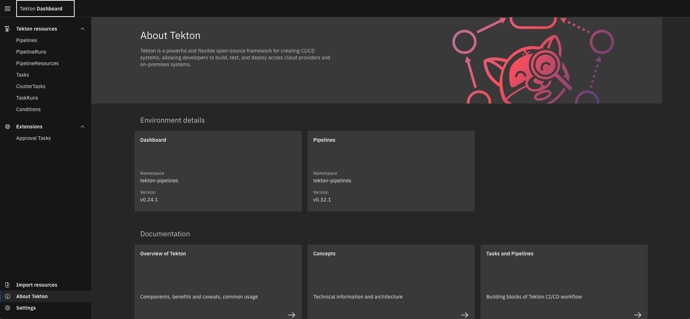

As part of the detail view of the approval task you can see directly information about decision on given task and how many approvers have already made decisions.

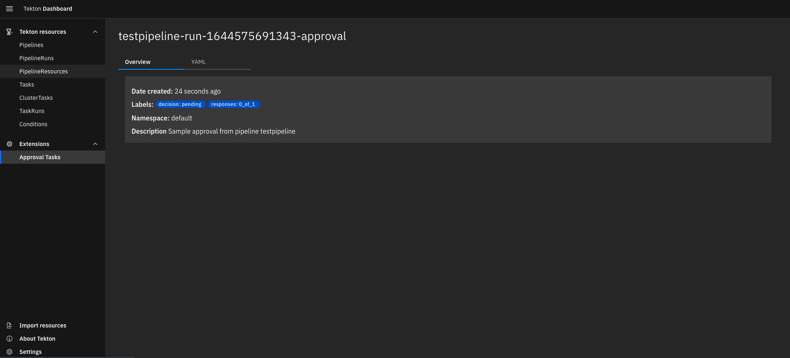

### Approval forms

Approval tasks come with basic UI capabilities to help approvers provide their decision (approve or reject). When email notifications are used, then each approver will get an email with dedicated link to the form.

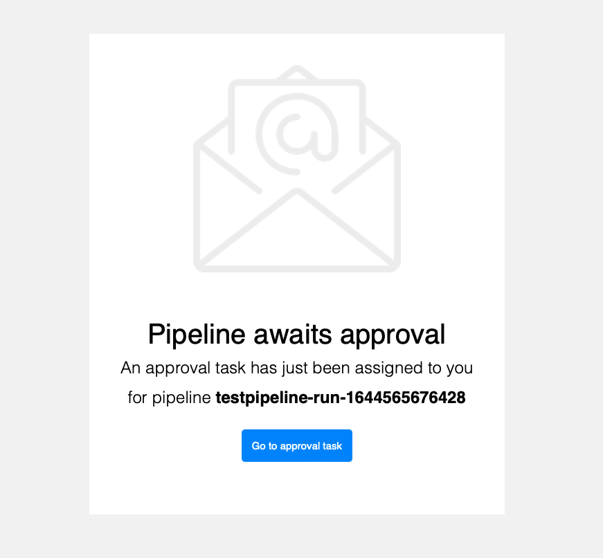

On the form there is option to add optional comment that will be then available in the further tasks of the pipeline as part of the decision results.

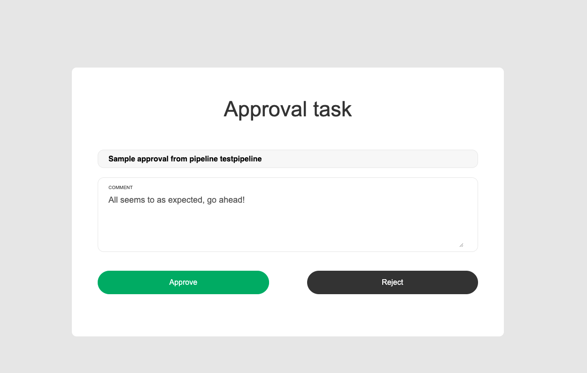

Approval tasks can also be found via direct access form that can be found on the root URL of the service deployed as part of this project.

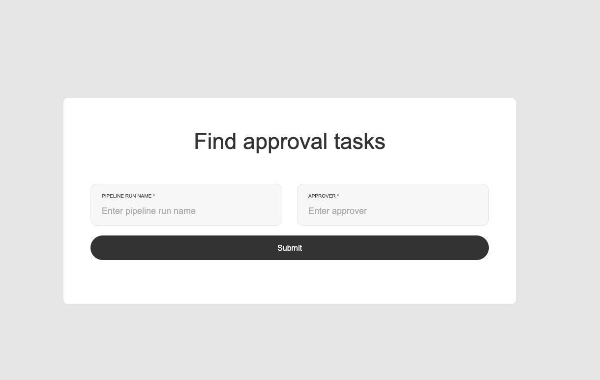

In the form you need to provide

- pipeline run name - name of the pipeline run you want to find tasks for
- approver - approver (user name or email or whatever else was used in pipeline definition) that tasks should be found for

This will provide a list of tasks available with links to the form to provide decision.

### Approval dashboard

Version 0.3.0 introduced a dashboard like endpoint that allows users to receive real time updates on thier approval tasks. A sample page that allows to specify user and group can be found at `/tasks.html` path of your approval
task site. Once user connects to the approval tasks the tasks will automatically show up on the board. 

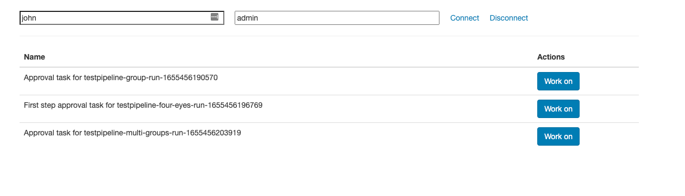

In addition, tasks that were completed automatically disappear from the board as well.

### Management view (for admins only)

Approval tasks comes with management view that is giving an internal insight into what is behind the tasks. It is process management view as approval tasks are based on workflows (built with [Automatiko project](https://github.com/automatiko-io/automatiko-engine)). You can see there details on each  workflow instance that is used behind the scenes to provide this feature to tekton pipelines.

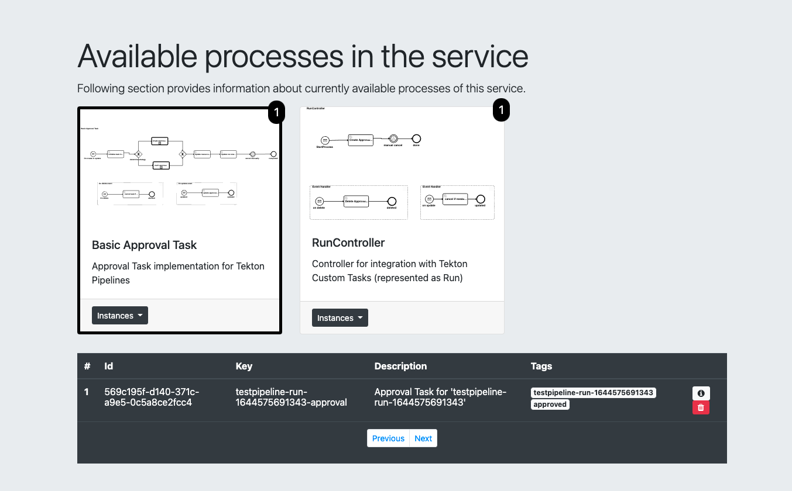

## Installation

This section will guide you through all the steps to make approval tasks run in tekton.

### Install Tekton and Tekton Dashboard

Following command will install Tekton and Tekton Dashboard into your Kubernetes cluster

````
kubectl apply --filename https://storage.googleapis.com/tekton-releases/pipeline/latest/release.yaml

kubectl apply --filename https://github.com/tektoncd/dashboard/releases/latest/download/tekton-dashboard-release.yaml
````

### Configure Tekton

To be able to use Tekton with Approval Tasks you need to enable use of custom tasks.

````
kubectl edit cm feature-flags -n tekton-pipelines
````

In there find the line for `enable-custom-tasks` and check its value to `true`


### Install Approval Tasks CRD

NOTE: All scripts for Approval Tasks can be found in `k8s` directory of this repository

First step is to create CRD of Approval Tasks

````
kubectl apply -f k8s/approvaltasks.tekton.automatiko.io-v1.yml
````

### Install Approval Task Tekton Dashboard extension


To be able to see Approval Tasks in Tekton Dashbord there is a need to create extension and cluster role and cluster role binding for it to allow Tekton Dashboard read and watch approval tasks objects.

````
kubectl apply -f k8s/approvaltasks-dashboard-ext.yaml
kubectl apply -f k8s/approvaltask-dashboard-cr.yaml
kubectl apply -f k8s/approvaltasks-dashboard-crb.yaml
````

### Install approval tasks

Lastly, install the approval tasks into your cluster

NOTE: It comes with default values for service URL and namespaces to watch. Please look into them before deployment, there are represented as environment variables of the deployment and have following values


````
- name: QUARKUS_OPERATOR_SDK_NAMESPACES
  value: default
- name: QUARKUS_AUTOMATIKO_SERVICE_URL
  value: http://localhost:9000
````

Change them accordingly to your environment needs.

````
kubectl apply -f k8s/kubernetes-basic.yml
````

If you want to use approval tasks with email notifications configure email server and use 

````
kubectl apply -f k8s/kubernetes-email.yml
````

#### Configure email server

To enable email notification, approval tasks deployment must be equipped with additional environment variables. A template for it can be found in `k8s` directory.

````
- name: QUARKUS_MAILER_FROM
  value: youruser@gmail.com
- name: QUARKUS_MAILER_HOST
  value: smtp.gmail.com              
- name: QUARKUS_MAILER_PORT
  value: "587"
- name: QUARKUS_MAILER_USERNAME
  value: youruser@gmail.com
- name: QUARKUS_MAILER_PASSWORD
  value: password        
````

Above properties must be set based on your email server before deployment.

#### Configure persistence

By default Approval Tasks container runs with file system based persistence. It can actually be used like that as it can easily recover all running instances of pipeline runs that require approvals but it can lead to duplicated email notification being sent. 

To avoid that and preserve running instances across restarts of the container behind approval tasks you can easily use persistent volumes to be mounted to the container.

IMPORTANT: Persistent volume used for storage for approval tasks data should use file system that have support for 
[extended attributes](https://en.wikipedia.org/wiki/Extended_file_attributes). Using such file system will significantly improve performance in case there are many active instances of approval tasks.

To configure persistent volume for approval tasks, first create persistent volume claim

````
apiVersion: v1
kind: PersistentVolumeClaim
metadata:
  name: approvaltasks-pv-claim
spec:
  accessModes:
    - ReadWriteOnce
  resources:
    requests:
      storage: 1Gi

````

Next, modify deployment of approval task to use the persistent volume claim

````
spec:
  volumes:
   - name: approvaltasks-pv-storage
     persistentVolumeClaim:
       claimName: approvaltasks-pv-claim
  containers:
````

mount the volume to a path

````
  volumeMounts:
   - mountPath: "/data"
     name: task-pv-storage
````

and set additional environment variables to instruct it where data should be stored

````
- name: QUARKUS_AUTOMATIKO_PERSISTENCE_FILESYSTEM_PATH
  value: /data/processes
- name: QUARKUS_AUTOMATIKO_JOBS_FILESYSTEM_PATH
  value: /data/jobs  
````

This will configure all the persistent data to be stored in external storage.

A complete example can be found in [k8s/kubernetes-basic-pv.yml](k8s/kubernetes-basic-pv.yml)

#### Ingress

Default deployment scripts create on service but not ingress as it really depends on your target kubernetes cluser. So this needs to be configured separately and the URL used on the ingress must be used for `QUARKUS_AUTOMATIKO_SERVICE_URL` in deployment.

for minikube you can use port forward for both Tekton Dashboard and Approval Tasks

```
kubectl --namespace tekton-pipelines port-forward svc/tekton-dashboard 9097:9097

kubectl port-forward svc/automatiko-approval-task 9000:80

````

#### Secure access to approval tasks

By default Approval tasks are configured to be open, meaning do not require authentication to access approval task but 
even without authentication users must know both pipeline run name and the user id (or email) that the task is assigned to.

In many situations, authentication is required and to comply with this requirements Approval Task takes advantage of
[OAuth proxy](https://oauth2-proxy.github.io/oauth2-proxy) that allows to configure it with various identity providers
such as 
- Google
- Azure
- Facebook
- GitHub 
- and others

Security is built based on side car that runs the OAuth proxy and only that container is exposed via service and then ingress.

Here are the relevant parts of the deployment manifest that configures it

First is the deployment to define the second container with OAuth

````
 containers:
        - env:
            - name: KUBERNETES_NAMESPACE
              valueFrom:
                fieldRef:
                  fieldPath: metadata.namespace
            - name: QUARKUS_OPERATOR_SDK_NAMESPACES
              value: default
            - name: QUARKUS_AUTOMATIKO_SERVICE_URL
              value: https://my-public-known-host.com 
            - name: QUARKUS_PROFILE
              value: secured                
          image: automatiko/automatiko-approval-task
          imagePullPolicy: IfNotPresent
          name: automatiko-approval-task
          ports:
            - containerPort: 8080
              name: http
              protocol: TCP
        - name: oauth-proxy 
          args:
            - --provider=github
            - --https-address=
            - --http-address=:8888
            - --email-domain=*
            - --prefer-email-to-user=true
            - --upstream=http://localhost:8080
            - --client-id=GITHUB_CLIENT_ID
            - --client-secret=GITHUB_CLIENT_SECRET
            - --cookie-secret=0rM16Iv8aSvlOZYXuabusXO98_y6Yf7QYjcIhXk67Dw=
            - --pass-access-token=true
          image: quay.io/oauth2-proxy/oauth2-proxy
          imagePullPolicy: IfNotPresent
          ports:
            - name: oauth-proxy
              containerPort: 8888    
              protocol: TCP      
````

Important parts to note

- `QUARKUS_PROFILE` is set to `secured` which configures the service to require authentication, it can also be set to `securedwithemail` if both security and email notifications are desired
- a new container `oauth-proxy` is added with configured GitHub provider, see all configuration options [here](https://oauth2-proxy.github.io/oauth2-proxy/docs/configuration/oauth_provider)
- approval task is (as usual) exposed via 8080 port
- oauth proxy is exposed via 8888 port

Next is to configure the service to go via oauth proxy instead of approval task

````
apiVersion: v1
kind: Service
metadata:
  labels:
    app.kubernetes.io/name: automatiko-approval-task
    app.kubernetes.io/version: 0.0.1
  name: automatiko-approval-task
spec:
  ports:
    - name: http
      port: 80
      targetPort: 8888
  selector:
    app.kubernetes.io/name: automatiko-approval-task
    app.kubernetes.io/version: 0.0.1
  type: ClusterIP
````

This will then go via oauth proxy container before the approval task is accessed ensuring that all traffic to the application
is secured.

A complete example can be found in [k8s/kubernetes-oauth.yml](k8s/kubernetes-oauth.yml)

# Use it

Once a instance is complete you can deploy the task and pipeline to get the first approval task from Tekton pipeline.

````
kubectl apply -f k8s/test/print.yaml
kubectl apply -f k8s/test/pipeline-single.yaml
````

Then head to Tekton Dashboard where you should see something like this

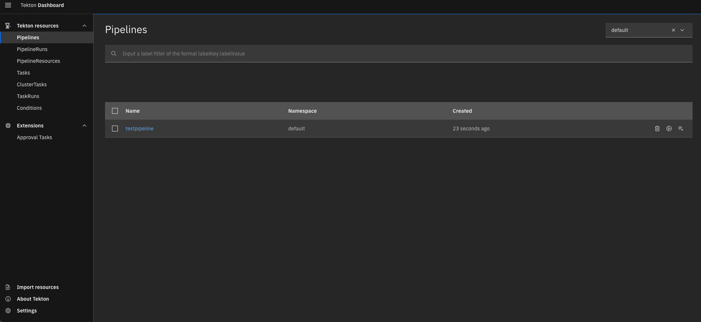

and just run an instance of the pipeline. Next you can go to Approval Tasks in the Extensions and should see one instance there too. If you to into details you will see labels that indicate the state of it

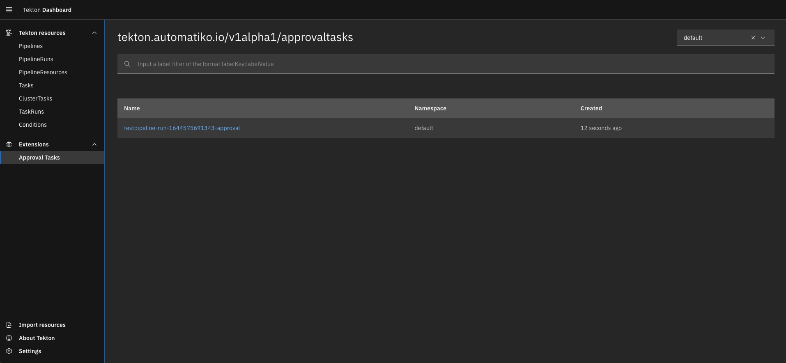

and when going to YAML view you will see an `approvalUrl` in the status section. Copy that url and open in new window, it will take you to either search for (when using MULTI strategy) or directly to the form (when using single strategy).


If you use single strategy and assigned approvers to it, you might need to append `?user=YOUR_USER_NAME` or `?group=YOUR_GROUP` to the url. Groups can be given multiple times.

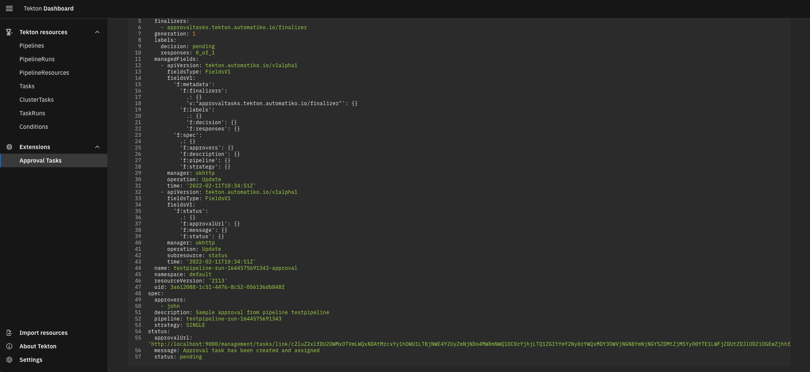

Once you made decision (approve or reject) the pipeline run will complete.


and the approval task instance will also be updated (look at labels)

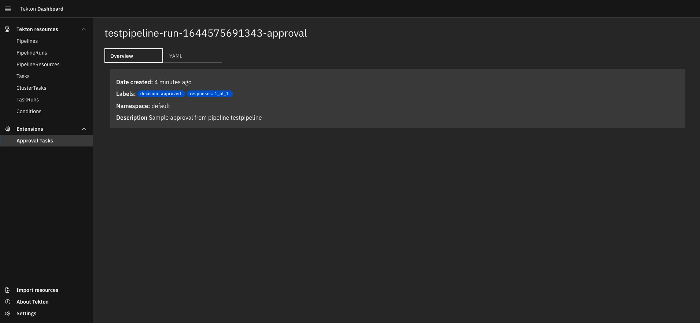

If you want o clean it up, just delete pipeline run and all other resources will be automatically cleaned. This is actually a good practice to have some sort of cleanup of complete pipeline runs to ensure the best performance.
